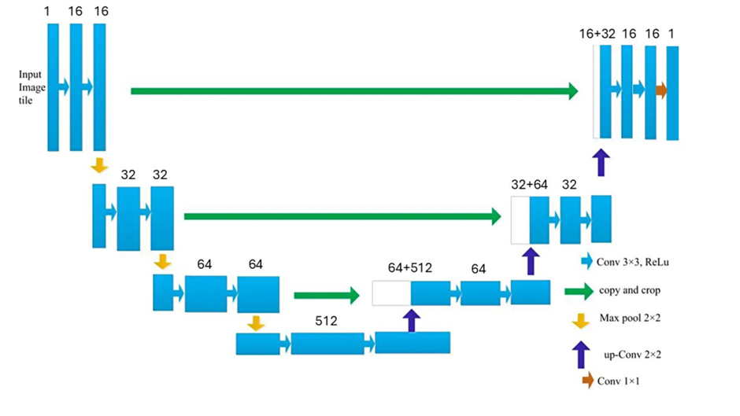
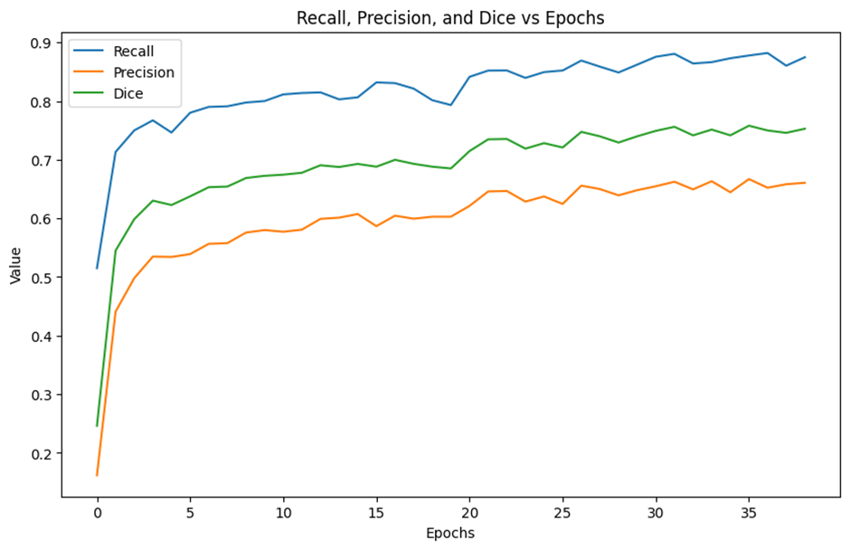
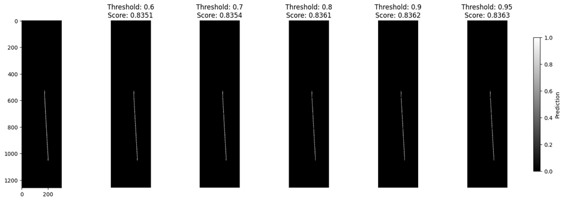
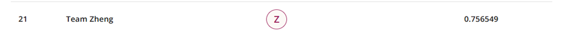
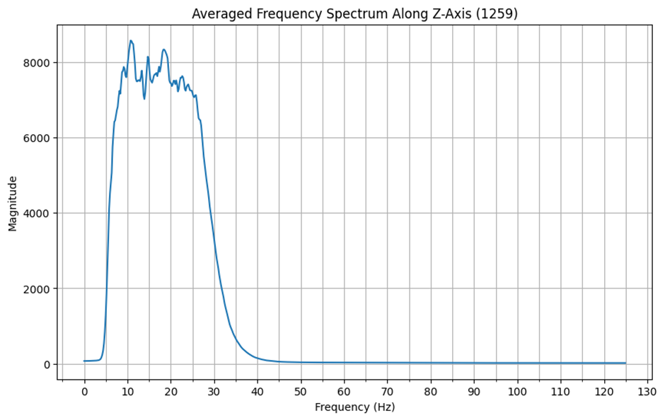
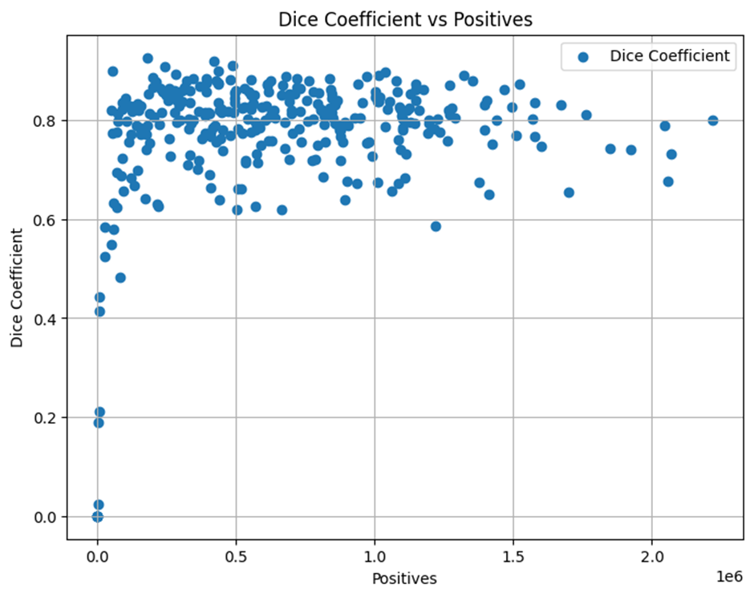
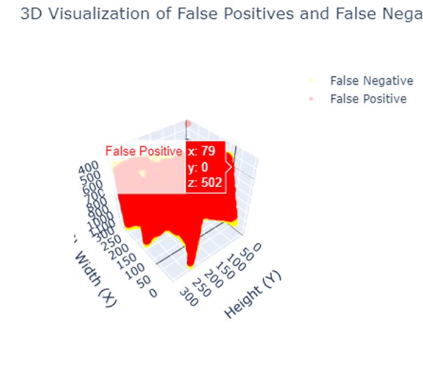

# Dark side of the volume

## 1\. 前言 (Overview)
本專案為機器學習課程的期末專案，主要任務是對三圍地震資料中的斷層 (Fault) 位置進行自動化偵測。對於地質研究來說，地震斷層判讀非常重要，但傳統上需要專業人員手動識別並標記，費時費力且容易出現人為誤差。 近年來，由於深度學習在影像分割 (特別是U-Net架構) 有顯著成效，我們嘗試以 2D U-Net 以及 3D U-Net 兩種方法來完成這次挑戰。  
然而，初期僅使用 2D U-Net 處理三維資料的切片時，忽略了 Z 軸方向的空間連續性，導致預測分數 (Dice) 僅約 0.34。為克服此限制，我們在後續採用 3D U-Net，搭配在資料集中抽取較小的立方體 (patch) 做訓練，並在損失函式中融入對資料不平衡的考量 (如 Balanced BCE、Tversky Loss)。最終，我們成功將模型在測試集上的 Dice 分數提升至約 0.75，大幅增進了斷層偵測的精度。本報告將詳細說明資料集特性、模型設計、實驗方法及成果分析，並討論實務應用及可能的優化方向。

GitHub Link: https://github.com/YuYang720/ML-final-project  
	  
## 2\. 挑戰與資料集 (challenge & Dataset)
本次挑戰的核心目標是針對 3D 地震資料 (seismic volume) 執行斷層偵測 (fault detection)，並將預測結果以指定格式上傳，最終由主辦單位根據分割評量指標進行排名。以下為挑戰與資料集說明。

### 2.1. 挑戰規則與評分方式

1. **評分指標：Dice Coefficient**  
    * 主辦單位使用 3D Dice Coefficient 來量化預測與真值之間的重疊程度。Dice 分數越高表示偵測結果越精準。  
2. **程式執行時間與資源**  
    * 在指定硬體上有推論時間限制，需在4小時內完成所有測試樣本的預測。  
3. **繳交格式**  
    * 最終需繳交的檔案為一個 `.npz` 檔，內含對每個測試樣本的預測座標或二值遮罩：  
        1. 每個測試樣本以其 sample ID 為 key；  
        2. 對應的值為一個二維或三維陣列，紀錄所有預測為「1」(fault) 的體素座標。  
    * 或者可由主辦方提供的 `create_submission` 函式產生檔案，確保符合指定格式。

### 2.2. 資料來源與資料集結構

1. 資料集來源  
    * 由主辦單位提供的合成/真實混合地震資料 (seismic volumes) 與對應斷層標記 (fault masks)。  
    * 每筆地震與斷層資料皆以 `.npy` 形式儲存，大小為 (300,300,1259)。  
2. 訓練集 (Training Set)  
    * 共 20 個 part，每個 part 含有 20 組 (地震 \+ 斷層) 資料，總計 400 個地震訓練樣本。  
    * 訓練資料體量約 320GB，每筆 3D 資料除了 seismic 影像還對應一個 fault mask（0 \= 非斷層，1 \= 斷層）。  
3. 測試集 (Testing Set)  
    * 共 5 個 part，每個 part 含有 10 組地震資料，故共有 50 個測試樣本。  
    * 測試資料體量約 40GB。此部分沒有公開的真實 fault mask，需在推論後提交預測結果做評分。  
4. 資料型態與大小  
    * 每筆地震資料：`float64` 浮點數陣列 。  
    * 每筆斷層資料：`uint8` 二值 (0/1) 陣列 。  
    * 三維形狀：(300, 300, 1259)；各維度可對應 inline / crossline / depth 等地震維度。

綜合以上，本次挑戰 (Challenge) 要求隊伍針對巨量且高維的地震資料，進行斷層 (fault) 分割並提交結果，主辦方使用 3D Dice 進行評分。參賽者不僅要顧及模型偵測效果，還需克服在 320GB 訓練集 與 40GB 測試集 上的記憶體與計算瓶頸，並於指定時間內完成預測，以符合繳交規範並爭取高排名。

## 3\. 方法 (Method)
此為重點章節，將簡單帶過2D U-Net之介紹，著重於 3D U-Net 的架構以及策略的理論部分。

### 3.1. 2D U-Net   
在本專案的初步嘗試中，我們先使用 2D U-Net 架構來進行斷層偵測。2D U-Net 主要透過 Encoder-Decoder 的架構，並在對應層之間透過 Skip Connection 將高解析度特徵保留並融合至解碼端，以達到 segmentation 的目的。以下簡述 2D U-Net 設計與流程:

1. **前處理:** 將 3D seismic 資料在某一維度上切割成 2D 影像，每張影像尺寸 **(300 x 1259)** 作為輸入。  
2. **Encoder:** 以 2D 捲積與 MaxPooling 反覆堆疊，每一次 Pooling 都會使影像寬高縮小、通道數增加，進而學習到更深層的特徵。  
3. **Decoder:** 與 Encoder 相對應的鏡像結構，包含 Upsampling 或轉置捲積，將空間維度放大回原本解析度。並與 Encoder 相應層的特徵圖進行 skip connection 以保留細節。  
4. **輸出層:** 最後使用 1x1 捲積將通道數壓縮到 1，輸出二元分類 (0代表無斷層，1代表有斷層) 的 Mask。

由於 2D U-Net 架構多半直接沿用助教提供的範例程式，以下會講解在此基礎上做的關鍵改動:

1. **Dropout:**  
    * 在 Encoder 或 Decoder 的卷積層之後額外加入 Dropout 層，減少 overfitting。  
    * 透過在訓練時隨機丟棄部分神經元，使模型更具泛化能力。  
2. **Early Stopping:**  
    * 設計一個 Early Stopping 機制，在特定 step 數內如果 Dice 指標沒有改善就停止訓練。  
    * 目的在於縮短訓練時間，避免過度訓練或浪費運算資源。  
3. **Learning Rate Scheduler:**  
    * 在訓練過程中，如果經過幾個 epoch 的訓練後，loss 都沒有下降的話就降低 Learning Rate，來達到更好的學習效果。

雖然 2D U-Net 在概念上雖然相對直觀，但由於地震資料本質上是 3D 且 fault mask 的分佈極度稀少，2D 模型往往難以捕捉完整的三維構造特徵，最終在本競賽中的分數為 0.34 不算理想。因此，我們後續轉向 3D U-Net 來提升斷層偵測的表現。

### 3.2. 3D U-Net 
為了更充分捕捉地震資料的三維結構，本研究將 U-Net 延伸至 3D 版本 (3D U-Net)，藉由在深度 (Depth) 維度上同時進行卷積與池化，讓模型能更完整學習到地層在三維空間的變化與斷層邊界位置。以下是 3D U-Net 的主要方法與設計思路：

1. **3D Encoder-Decoder 架構 (Downsampling & Upsampling)**  
    * **Encoder：** 連續使用多層 3D 卷積 \+ ReLU \+ 3D Max Pooling，使特徵圖在空間維度上逐步縮小但通道數增大。同時保留了立體特徵，可捕捉地層在 x,y,z 三軸方向的連貫性  
    * **Decoder：** 鏡像結構，藉由 3D UpSampling 將特徵圖恢復到原始維度，同時透過 skip connection 將對應層的 Encoder 特徵拼接 (concatenate) 到解碼端，保留局部細節。  
    * 最後以 1×1×1 立體卷積 (channel=1) 輸出每個體素 (voxel) 為斷層 (1) 或非斷層 (0) 的機率。  
2. **資料切塊 (Patch-based) 與 資料不平衡處理**  
    * **Patch-based 訓練**：由於整個地震體 (如 300×300×1259) 相當龐大、GPU 記憶體有限，本研究採用「切塊 (patch-based)」的方式：隨機從 3D volume 中抽取若干 (128×128×128) 的立方體 (cube) 作為一個批次 (batch) 進行訓練  
    * **不平衡處理：** 針對斷層 (1) 與非斷層 (0) 之間的嚴重不平衡問題，我們在抽取立方體時會 **刻意提高「含有斷層的 patch」的抽樣比例** ；此外，在損失函式 (Loss) 中加入 正樣本權重 (pos\_weight) 或使用 Tversky / Balanced BCE 等方法，讓模型在訓練時更加關注稀少且重要的 fault 區域。
3. **Bandpass Filter** 
    * 為了進一步處理地震資料中的雜訊，我們曾嘗試在讀取原始地震數據後，使用 Butterworth bandpass filter (5 Hz \~ 30 Hz) 進行頻率範圍過濾。  
    * 目標是消除過高或過低頻率成分的干擾，保留較具地質意義的訊號。但由於實務上對不同頻帶的反應不一定固定，需要評估其對最終分割成效的影響；本實驗中加上 bandpass filter後分數反而下降，所以最後決定不採用。  
4. **Loss 與 評估指標 (Dice, Balanced BCE, Tversky)**  
    * **Dice：** 評估階段採用 3D Dice Coefficient 衡量預測與真值的重疊程度。  
    * **Balanced BCE / Tversky：** 為解決 fault 占比極低的問題，我們在模型訓練時嘗試了多種 Loss 設計，包含  
        a. **Balanced BCE：** 動態計算正負樣本權重，讓 **斷層 (y=1)** 的損失得到額外放大。  
        b. **Tversky：** 調整 FP、FN 的懲罰係數，使模型更關注罕見且關鍵的斷層區域。  
5. **閾值 (Threshold) 與 後處理 (Post-processing)**  
    * 模型最終輸出為 **[0,1]** 機率，在推論 (inference) 時需設定一個閾值 (e.g., 0.9) 將預測結果二元化，以獲得最符合實際需求的 fault mask。  
    * 此外，對於邊緣雜訊或不可信區域，可能會在後處理中直接將其設為 0，以避免過多誤判。

相較於 2D U-Net 只能在切片平面學到局部特徵，**3D U-Net** 更能捕捉整體立體結構。但是，3D 模型也帶來更多計算量與記憶體壓力，需要在 Patch 抽樣、不平衡處理、以及(可選的) bandpass 濾波等方面進行綜合考量。

接下來的 Implementation 章節將聚焦在程式層面的實現細節，並在實驗與結果中討論例如「bottleneck 通道數」「是否使用 bandpass filter」「Loss 設定」對分數的影響。

## 4\. 實作細節 (implementation)

本章將更細緻地解釋在 Method 章節提到的結構與策略，並展示如何在程式層面實現。完整程式碼見 GitHub 連結。

### 4.1. 2D U-Net implementation

在本專案的初始階段，我們基於助教提供的 sample code 修改並實作出一個 2D U-Net 用於地震資料斷層偵測。以下重點整理我們在程式與訓練流程上的設計與實作方式。

#### 4.1.1. 程式架構:

1. 檔案名稱: `2D_Unet.ipynb`  
2. 核心類別與函式:  
    * `ContractingBlock`、`ExpendingBlock`: 2D 版的 Encoder/Decoder 基本模組，繼承自助教 sample code。  
    * `Unet`: 包含 4 個下採樣與 4 個上採樣階段的整體 2D U-Net 架構。。  
    * `train()`: 定義訓練流程，包括資料載入（seismic \+ fault）、Loss / Backprop / Optimizer 等。

#### 4.1.2. 修改程式要點

1. Dropout  
    * 在 ContractingBlock、ExpendingBlock 的卷積層之間插入 `nn.Dropout(0.3)`，以 `self.dropout = nn.Dropout(0.3)` 實作。  
    * 在 Forward pass 中，通常在 ReLU 之後、MaxPool / UpSample 之前插入 `self.dropout(x)`，讓每個神經元有 30% 機率被隨機丟棄，降低overfitting。  
2. Early Stopping  
    * 在 Training loop 中定義 `max_no_improvement_step = 20`，當模型的 Dice 分數在連續 20 次對應顯示步驟內都沒有提升時，提前停止訓練。  
    * 透過此機制，避免浪費運算資源在無改善的狀況下繼續訓練。  
3. Learning Rate Scheduler  
    * 採用 `torch.optim.lr_scheduler.ReduceLROnPlateau`，如果連續 3 個 epoch Loss 沒改善，就自動將學習率減半 (`factor=0.5`)，幫助模型更穩定收斂。

#### 4.1.3. 訓練流程

1. **資料切片**：將 3D seismic volume 按某一維度（例如 inline）切成 2D slice（如 300×1259）後，進行縮放或裁切，再與對應的 fault mask 配對。  
2. **DataLoader：**使用 `torch.utils.data.TensorDataset(volumes, labels)` 搭配 `DataLoader` 實作 batch 讀取；batch size 通常設定為 1。  
3. **Loss 與 Optimizer：**  
    * 預設使用 `nn.BCEWithLogitsLoss` 作為損失函式。  
    * Optimizer 則採用 `Adam。`  
    * Epoch 數約 30，學習率約 `1e-5`。

整體而言，2D U-Net 雖然在初期快速驗證了模型可行性，但在本競賽中表現仍有侷限。具體成果與評估結果，將於後續章節或實驗部分提及。

### 4.2. 3D U-Net implementation

在本章，我們聚焦於 3D U-Net 的具體程式實作，包含 資料生成器（`data_generator()`）、模型結構（`unet()` 內的 3D convolution block）、損失函式（`Balanced_BCE()`、`tversky_loss()`）等。這些段落都直接參考實際程式檔 `3d_unet.ipynb` 。相比於 Method 章所述的理論，這裡更深入「我們在程式層面如何寫」與「關鍵參數與變數意義」。

#### 4.2.1. 程式碼架構

1. **主要檔案：**  
    * `3D_Unet.ipynb`：實作 3D U-Net 的核心，包括 **模型定義**、資料載入 (patch-based sampling) 函式、訓練迴圈、推論函式 (inference) 等。  
    * `utils.py`：輔助函式，例如 `rescale_volume`、`create_submission`、`get_dice` 等。  
2. **關鍵類別/函式:**  
    * Model 定義：`unet()` 建立 3D U-Net 的 Encoder/Decoder 架構。  
    * 損失函式：`balanced_BCE()`、`tversky_loss()`、以及一些輔助函式 (如 `dice_score`)。  
    * Data generator：`data_generator()` 與 `create_tf_dataset()`，負責載入與抽樣 3D patches。  
    * Training/Inerence：`train()` 執行訓練流程，`inference()` 進行推論 (sliding window)。

#### 4.2.2. data\_generator( )：動態產生 3D 立方體

在 3D 模型中，若直接使用整個三維地震體做 batch 訓練，會因 GPU 記憶體限制而不可行；因此使用**隨機抽取 patch** 方式，從硬碟動態讀取並隨機抽取 3D 卷積塊 (cube)，並同時考量「fault 區域稀少」的特性。以下講述其要點:

1. **整體結構**  
    * 這是一個 **無限迴圈** (`while True:`)，搭配`tf.data.Dataset.from_generator` 動態產生批次資料。  
    * `faultless_ratio` 用於控制「有 fault」與「無 fault」的抽樣平衡。例如 `faultless_ratio=0.1` 代表有 10% 機率抽取到「純背景」patch。  
    * `num_samples = 16`：每個檔案要抽 16 個 3D cube。  
    * `min_fault = 4096`：若 fault 像素數量 \>= 4096，才能算是有明顯斷層可供模型學習。  
    * `volume_size = 128`：對整個 seismic volume，每次隨機抽取一個 (128×128×128)的區塊。  
2. **關鍵步驟**  
    * 隨機抽取起始座標 `(d_start, h_start, w_start)` 以截取 128×128×128 之立方體。  
    * `with_fault = np.random.rand() > faultless_ratio` → 依照機率決定「這次要不要找有明顯斷層的塊」。  
    * `(num_fault >= min_fault) == with_fault` → 只有在「想要有斷層」且「實際上斷層數量≥min\_fault」或「想要無明顯斷層」時才產出這個樣本。  
    * `yield`：此 generator 每找到一塊符合條件的 3D volume 就吐出 (seismic\_volume, fault\_volume)，給上層的 Dataset 取用。若抽不到符合條件的 patch，會在內層迴圈再嘗試有限次數 (共16次)。  
3. **功能意義:**  
    * **平衡資料:** 若 fault 佔比很小，易導致模型過度預測背景。故透過改變 faultless\_ratio，控制抽樣有無斷層塊的比例。  
    * **隨機抽樣**：在整個 3D 影像中持續亂數選 128³ 大小的 cube，有助於增強模型對整個資料空間的學習。

#### 4.2.3. 3D U-Net Model

以 Encoder-Decoder \+ skip connection 落實 3D U-Net。Figure 1.為本研究實作出的 3D U-Net 架構圖。

Figure1. 3D_Unet_structure

1. **Input shape:**   
    * `input_size = (None, None, None, 1)`：表示深度、高度、寬度可變，但 channel \=1。若要固定128，也可填 (128, 128, 128, 1)。  
2. **Downsampling path (Encoder)**  
    * `conv1 → conv1 → pool1`  
        - 兩次 3×3×3 卷積 \+ ReLU，channel=16，接著 MaxPooling(2,2,2)，空間尺寸縮小一半。  
    * `conv2 → conv2 → pool2`：channel=32，再次空間縮小。  
    * `conv3 → conv3 → pool3`：channel=64，再次空間縮小。  
    * `conv4 → conv4`：channel=512，不再 pool，因為這是最底層 bottleneck 區域。  
3. **Upsampling path (Decoder)**  
    * `up5`：將 `conv4` 上採樣 2 倍，並 concatenate 與 `conv3` 的輸出 (skip connection)。接著兩次 3×3×3 卷積 channel=64。  
    * `up6`：將 `conv5` 上採樣後與 `conv2` 拼接 → 3×3×3 卷積 channel=32。  
    * `up7`：將 `conv6` 上採樣後與 `conv1` 拼接 → 3×3×3 卷積 channel=16。  
4. **Output layer**  
    * `conv8 = layers.Conv3D(1,(1,1,1),activation='sigmoid')`：輸出 1-channel 的 mask，經過 sigmoid 轉換為 [0,1]。  
* 每個 voxel 表示該位置屬於 fault 的機率。  
5. **重要特點**  
    * 每次下採樣 (pooling) 後 channel 數翻倍，空間維度減半；最深層 (bottleneck) 可視需求調整 128 / 512 channels。  
    * 上採樣時不用 `nn.Conv2d`，而是直接用 Keras 自帶的 `layers.UpSampling3D`，再配合 skip connection。  
    * skip connection：將對應 encoder 層的 feature map 與 decoder 的上採樣結果在 channel 維度 (axis=-1) 上拼接，以保留高解析度特徵。

#### 4.2.4. Balanced\_BCE( )

地震斷層常是極度不平衡的，所以我們使用 Balanced BCE loss 來處理。以下為程式邏輯和理論講解：

1. 對真實標籤  yi  做 **label smoothing** 處理:

$${y^s}_i = y_i \times (1 - \alpha)+(1 - y_i) \times \alpha$$

2. 為了**平衡正負樣本**，引入參數  與 `pos_weight`。其中:  
    * 平衡係數 $\beta$ 
$$ \beta = 0.99 \times \frac{count_{neg}}{count_{neg} + count_{pos}} = 0.99 \times \frac{\sum_{i=1}^N (1 - {y^s}_i)}{N}$$
    * 正樣本加權 pos\_weight
$$pos_{weight} = \frac{\beta}{1 - \beta}$$

3. **Balanced BCE Loss 公式**  
    * 在標準二元交叉熵 (Binary Cross Entropy) 中，單一樣本的損失可寫為: 
$$l_i = -[{y^s}_i \times log(p_i) + (1 - {y^s}_i) \times log(1 - p_i)]$$ 
    * 但我們要對正樣本的 $log(p_i)$ 乘上一個權重 `pos_weight`，使得正樣本的 loss 更大。同時，程式把損失的兩部分 `term_0` 和 `term_1` 寫開：  
        - term\_0（負樣本部分）：(1−yis ​)log(1−pi)  
        - term\_1（正樣本部分）：yis ​log(pi)  
    * 再加上考慮對整個 batch 的平均: 程式中的 `K.mean(...)`，可得最終損失:
$$ L_{balanced} = -\frac{1}{N} \sum_{i=1}^N [(1 - {y^s}_i) \times log(1 - p_i) + pos\_weight \times {y^s}_i log(p_i)]  $$

透過 正樣本權重 pos\_weight的動態調整，來平衡正、負樣本對損失函數的影響。在嚴重不平衡的資料中，可以有效提高對少數正樣本（或負樣本）的關注度，並且可搭配 label smoothing 讓訓練更穩定。

#### 4.2.5. tversky\_loss( )

另一種解決不平衡的手段，類似 Dice，但可透過超參數 α,β 來更重懲罰 FP 或 FN，以下為詳細講解。

1. **Tversky index**  
    * Tversky index 是 Dice / F-beta 的廣義版本，用 `alpha` 與 `beta` 來調整 FP 與 FN 的相對權重。  
    * 計算方式:
$$ Tversky = \frac{TP}{TP + \alpha \cdot FP + \beta \cdot FN } $$
2. **關鍵**  
    * `effective_tp = tf.maximum(tp, tp_threshold)`：如果 TP \< 1024，則強制視作 1024，避免正樣本太少時被懲罰得太嚴重。  
    * `alpha=0.25`、`beta=0.75`：模型更重視 FN（遺漏錯誤）的懲罰。  
3. **回傳**  
    * `1 - tversky`: 做為 Loss；最小化 1 \- Tversky 以最大化 Tversky 指數。

#### 4.2.6. train(): 訓練細節

1. **Training Loop**  
    * 以 `data_generator` \+ `create_tf_dataset` 建立一個可無限產生 $128^3$ 立方體的資料集。  
    * `num_samples=16` 表示對每個 `(seismic, fault)` 檔案隨機抽符合條件的 16 塊 3D volume。  
    * `Batch_size = 1` 因資源有限，GPU記憶體較小，所以將 Batch size 設為 1。  
    * `threshold = 0.9` 評估時要用來計算 `Recall/Precision/Dice` 的閾值。  
        - 代表要有 0.9 以上的可信度才預測為 1，減少誤判 (false positives)。  
    * `steps_per_epoch=1000` 每 epoch 訓練 1000 個 batch。由於 Dataset 是無限 yield，需要指定要跑多少步才算一個 epoch。  
2. **Optimizer & Scheduler**  
    * Loss: `Balanced_BCE`  
    * 使用 `Adam Optimizer`，learning rate 初始 0.0001  
    * `ReduceLROnPlateau`：若指定的監控值 ( `monitor='dice'`) 在 `patience = 3` 個 epoch 都沒有提升，就將 LR 乘 `factor=0.5`。  
        - `mode='max'` 表示要 dice 指標越大越好，若沒有提高就 reduce LR。

#### 4.2.7. 推論 (Inference) & 後處理

推論部分與訓練類似，也必須應對「無法一次處理整個 3D volume」的問題。我們在 `inference()` 函式中以 **sliding window** 方式切塊推論：

1. **功能**  
    * 針對大尺寸的 3D volume `(300,300,1259)`，使用滑動視窗 `model_shape = (128,128,128)` 去逐塊 (patch) 推論。  
    * 可選 `threshold` 進行二值化，或傳回 `raw` 概率值。  
2. **邏輯**  
    * **計算 stride**： 90% overlap → `stride = (115,115,115)`  
    * **確保覆蓋邊界**：手動把最後一步設成 `300(或1259)-128` 以貼齊邊緣。  
    * **逐塊預測 :**  
        - `patch = input[x:x+128, y:y+128, z:z+128]`  
        - `累加到 output，並 weight_map += 1 表示該區域被多少 patch 覆蓋。`  
    * `對 output 做 output /= weight_map，得到平均預測值；若 raw=False，就再做閾值化 (output > threshold)。`  
    * `最後搭配` slice 清除 `raw_pred[:, :, :200] = 0`, `raw_pred[:, :, -20:] = 0，`Mask out `邊緣較無意義的資料`。  
3. **用途**  
    * 避免一次將 `(300,300,1259)` 全尺寸丟給網路導致 GPU 記憶體不足  
    * Overlap 可以減少 patch 邊緣的預測不連續問題。

#### 4.2.8. 小結

3D U-Net 在程式實作層面，整合了多項關鍵：

1. **data\_generator：**  
    - 動態抽樣 1283 patch，透過計算 fault 數量來平衡有/無 fault，避免大量背景資料淹沒正樣本。  
2. **Balanced\_BCE / tversky\_loss:**  
    - 在損失計算中加權正樣本，緩解斷層稀少問題。  
3. **3D Encoder-Decoder：**  
    - 使用 3D 卷積、池化與上採樣實現空間特徵學習。  
4. **Sliding Window 推論：**  
    - 將大體積資料分塊，避免 GPU 記憶體不足；並將每個 cube 重疊區域平均，得出預測結果。  
5. **可選的 Bandpass Filter：**  
    - 在資料讀取時做 5\~30 Hz 濾波，但最終成效需視實驗評估。

在此基礎上，我們成功將 3D U-Net 應用於地震資料之斷層偵測。至於各種參數 (例如 bottleneck channel, threshold) 的優化與實驗結果，將在後續 5.實驗與結果 章節詳細討論。

## 5\. 實驗與成果 (Experiment & Result)

本章將介紹本專案的實驗配置、模型訓練流程以及最終成果表現，並對關鍵實驗結果進行討論。主要聚焦在 3D U-Net 上之實驗與表現，並輔以 2D U-Net 的結果作為對照。

### 5.1. 實驗配置

1. **硬體資源**  
    * 使用一張 **NVIDIA RTX 4060 GPU** 進行訓練與推論。  
    * 單機訓練時間約 8-10 小時（30-40 個 epoch 之間），推論 (inference) 約 30 分鐘。  
2. **資料集拆分**  
    * Training set：前 16 個 part，共 320 筆 3D seismic data。  
    * Validation set：後 4 個 part，共 80 筆資料，但由於部分資料軸向標記錯誤（xy 軸反置），實際上並未使用。  
    * Testing set：另外 5 個 part，總計 50 筆 ，用於最終評分與提交。  
3. **訓練設定**  
    * **Epoch 數**：每次訓練約 30\~40 epoch；若連續 5 個 epoch 指標（Dice）無明顯提升，就中斷訓練。  
    * **Batch size**：因硬體資源限制，將 Batch size 設為 1，隨機抽取 128×128×128 之 cube 作為訓練樣本。  
    * **Loss**：主要比較 Balanced BCE、Tversky 等組合；另外嘗試在推論結果中切除高雜訊區域 (cut)。  
    * **濾波**：曾使用 butterworth bandpass (5\~30 Hz) 處理 seismic，但在本次實驗發現整體表現反而略微下降。

### 5.2. 不同實驗組合與結果

在訓練 3D U-Net 過程中，我們嘗試多種損失函式與後處理策略 (Cut)，最終取得下表之 Dice 分數。表中 “Cut” 表示在推論結果中，將 **最上方 200 層**與**最下方 20 層**的預測直接設為 0，以排除高雜訊區域。下表顯示官方測試集上的 Dice 分數對照。

| 方法組合  | Dice 分數 |
| :---- | :---- |
| 2D U-Net  | 0.341 |
| 以下皆為 3D U-Net 架構 |  |
| Tversky \+ Balanced BCE \+ Cut | 0.743 |
| Balanced BCE \+ Cut | 0.756 |
| Balanced BCE | 0.749 |
| Balanced BCE \+ butterworth filter (5\~30Hz) | 0.722 |
| UNet bottleneck 512 channels \+ Cut | 0.756 |
| UNet bottleneck 128 channels \+ Cut | 0.672 |

#### 5.2.1 整體結果對比

1. **Cut (top 200 \+ bottom 20 layers 清除)**  
    * 大多數實驗顯示，有做 Cut 的版本分數普遍高於不做 Cut（0.756 vs 0.749）。  
    * 代表在最上層 200 與底層 20 屬於高雜訊區域，直接不考慮可減少誤判。(詳見附錄A.3)  
2. **Loss 函式（Balanced BCE vs. Tversky）**  
    * 若只單純使用 Balanced BCE，成效不錯。  
    * 若再混合 Tversky，雖可同時針對 FP、FN 做權衡，但實驗反而略微降低分數（0.743）。  
    * 所以後續實驗以 Balanced BCE \+ Cut 為主要配置。  
3. **Bottleneck Channels**  
    * 實驗中將 3D U-Net 最底層通道數由 128 增至 512，Dice 有明顯提升（0.672 → 0.756）。  
    * 表明更大的 channel 空間能學到更豐富的三維特徵，特別是在複雜的斷層紋理上具顯著優勢。  
4. **Butterworth Bandpass Filter**  
    * 嘗試針對地震資料進行 5\~30Hz 的頻率濾波，分數卻從 0.756 降到 0.722，故後續不再使用。(詳見附錄A.1)

#### 5.2.2. 訓練指標趨勢

為了更直觀地觀察模型訓練過程，我們將每個 epoch 計算之 **Recall / Precision / Dice** 繪製成折線圖，如下圖所示

Figure 2. recall precision dice vs epoch 

### 5.3 Threshold 分析與可視化

在實際推論階段，**閾值 (threshold)** 的選擇會顯著影響結果。模型預測的是 **[0,1]** 機率，若閾值過低，容易產生大量 False Positive；若閾值過高，又可能忽略真正的斷層區域。為了找到相對合適的閾值，我們在某筆驗證資料上測試了多個 threshold (0.6、0.7、0.8、0.9、0.95)，並計算對應的 Dice 分數，結果如下圖所示：

可觀察到 :

1. Threshold \= 0.6：預測 mask 較完整，但也出現較多雜訊 (FP)。  
2. Threshold \= 0.9：雜訊大幅減少，然而在某些邊緣區域的斷層可能被誤裁減，造成 FN 上升。  
3. 在本次競賽中，我們最終使用 Threshold \= 0.9，因實驗顯示其整體 Dice 表現較佳，且雜訊可控。

### 5.4. 小結

綜合以上實驗可得以下結論：

1. Balanced BCE 與適當後處理 (`Cut`) 能進一步提升對稀疏斷層位置的辨識。  
2. Bottleneck channels：增加 3D U-Net 底層通道數可提升分數。  
3. Bandpass filter 與 Tversky 並未帶來好處，未來可能需針對更精準的頻段或方法來調整。  
4. 最終得到本組實作最佳成績為 0.756。

在後面兩章會針對此實驗結果更深入剖析並闡述未來可行的改進方向。

## 6\. 討論 (Discussion)

本章節將更深入探討在實驗與成果中所觀察到的現象，以及對於各種設計、參數與方法的反思，推測發生其現象的背後原因。

### 6.1. 模型架構與訓練策略

1. **2D U-Net 與 3D U-Net 成效差異**  
    * 由實驗結果可見，2D U-Net 在本次地震斷層偵測任務上的表現僅約 0.34 ，原因推測包括：  
    * **缺乏深度維度資訊**：2D 模型僅能透過單張切片學習，無法掌握層與層之間（z 軸）的連續上下文。而 3D 模型中，使用了Conv3D、MaxPooling3D 等運算；每個卷積操作在三維空間上同時進行特徵萃取，所以可充分利用地震資料的深度資訊，避免在 2D 切片方式下「切斷」垂直維度所蘊含的結構。。  
    * **資料不平衡更嚴重**：對於本來就稀疏的 fault，2D 切片若恰好缺乏 fault 區域，會加劇學習困難。  
  因此，在立體空間中的三維卷積 (3D Convolution) 對捕捉斷層走向、連續性等特徵有明顯優勢，也解釋了 3D U-Net 得分可達 0.75\~0.76。  
2. **Balanced BCE** 
    * 有效解決 fault 分布不均的問題。但使用 **Tversky** 造成分數下降至 0.743，稍低於僅用 Balanced BCE（0.749\~0.756）的表現。  
    * 推測在本資料下 Tversky 參數較難調整，導致結果不穩定。                                                                    
3. **Cut**：在多數實驗中，加入 Cut 可明顯降低噪訊與誤判  
    * 實務觀察發現，在最上層 200 及底層 20 這些區域，雜訊或空白訊號較多，屬「無效或混亂訊息」。  
    * 故將該部分直接設為背景 (0)，可減少誤判並提升 Dice。  
4. **Buttterworth bandpass filter**：造成分數下降。  
    * 推測濾除的頻率區段中可能含有與斷層定位相關的有用訊號。  
5. **Bottleneck Channels**  
    * 3D U-Net 最底層 (bottleneck) 若使用 512 channels，能保留較多深層特徵，最終取得 0.756 的最佳表現；若縮減至 128 channels，分數大幅降至 0.672，顯示該區段的表徵能力對斷層偵測非常關鍵。  
6. **訓練與推論策略**  
    * 本次以隨機抽取 128×128×128 之體積塊進行訓練，雖能成功學習整體分佈，但對部分極端情況（如 fault 極小或具強烈週期性）仍可能不足。  
    * 由於 Validation set 存在部分 xy 軸翻轉問題，未能在訓練中輔以驗證或調參，導致策略主要仰賴觀察 Dice 與 early stopping 來控制訓練進度。這可能在某些極端資料上降低模型泛化性。

### 6.2. 硬體資源限制

本研究原本計畫使用國往資源下進行訓練，但由於程式保存、資料及下載/模型訓練異常終止等等原因，改為在本地端，使用 RTX 4060 GPU 進行訓練。受限於 GPU 記憶體與運算量，導致：

1. **模型結構受限**：  
    * 為了在合理時間內完成訓練、避免記憶體爆炸，我們需將 batch size 維持在1，並限制最底層 (bottleneck) 通道數不宜過大。雖然使用 512 channels 已可有效提升分數，但若要嘗試更先進且更龐大的 3D 模型，仍恐面臨顯存不足的問題。  
2. **訓練與推論時間過長**：  
    * 單次訓練 30-40 epoch 需 8-10 小時，推論約 30 分鐘，導致可以做的實驗次數大幅減少，缺乏時間探索其他策略。  
3. **資料讀取與預處理難度增加**：  
    * 整個資料集規模高達數百 GB，需要同時考量 CPU/RAM 資源與 IO 速度，才能使 batch sampling 與 GPU 訓練流程順暢對接。

## 7\. 結論與未來展望 (Conclusion & Future work)

### 7.1.結論

1. 本專案從 2D U-Net 出發，最終切換至 3D U-Net，成功將 Dice 分數由約 0.34 提升至最高 0.756，顯示三維卷積在地震斷層偵測上的重要性。  
2. 損失函式與後處理策略對結果影響顯著，尤其 Balanced BCE 能有效緩解嚴重不平衡；適度刪除可能沒有訊號意義的邊緣切片 (cut) 亦能微幅提升分數。  
3. 本次使用相對較小的 bottleneck channels（128）易導致特徵不足；升至 512 channels 有助於捕捉更深層次的地質構造訊息。  
4. 整體而言，此方法已能在測試資料集中展現較佳的 fault segmentation 能力，為後續研究奠定基礎。

最終在官方評分中的 Dice 最高約為 0.756，並在 leaderboard 上排名 21，為本組實作最佳成績。以下為 leaderboard 截圖:

### 7.2. 未來展望

1. **更精準的資料檢核與清理**  
    * 修復或過濾像是 xy 軸翻轉、資料對齊失誤等問題，使 Validation set 能被納入訓練過程做更嚴謹的調參，提升模型泛化力。  
2. **擴增與後處理**  
    * 探討結合更全面的資料增強（如翻轉、旋轉、尺度變化）、3D morphological operations 等後處理手段，進一步濾除雜訊。  
3. **更先進的 3D 架構**  
    * 引入 Attention-based 模組（如 3D attention U-Net），或嘗試 nnU-Net，自動執行一系列超參數優化。  
    * 嘗試 3D Swin Transformer 或 UNETR (Transformer-based 3D segmentation) 等方法。  
4. **多任務學習或半監督學習**  
    * 可試著引入半監督或自監督方法，增大有效樣本量，改善模型泛化。  
5. **更佳的硬體資源**  
    * 未來若能取得更高階 GPU，可提升 batch size 或嘗試更多樣的模型與超參數設定，進一步探索 3D segmentation 的極限表現。  
    * 同時也可考慮進行分散式訓練或雲端資源配合，自動化增強與擴充資料集，以大幅縮短實驗迭代週期並擴充模型設計空間。

總結來說，本專案已成功應用 3D U-Net 在地震斷層偵測，取得不錯成績。後續仍可從資料品質、模型先進性、後處理方式等面向做更多嘗試，以讓深度學習模型在真實地震探勘中扮演更精準且穩定的角色。

## 8\. 參考資料

[1] ThinkOnward challenge:Dark side of the volume [https://thinkonward.com/app/c/challenges/dark-side](https://thinkonward.com/app/c/challenges/dark-side)

[2] ThinkOnward challenge  GitHub Repository, [https://github.com/thinkonward/challenges/tree/main](https://github.com/thinkonward/challenges/tree/main)

[3]Ronneberger, O., Fischer, P., & Brox, T. (2015).U-Net: Convolutional Networks for Biomedical Image Segmentation.In *Medical Image Computing and Computer-Assisted Intervention – MICCAI 2015* (pp. 234–241). Springer, Cham. [arXiv:1505.04597](https://arxiv.org/abs/1505.04597)

[4]Çiçek, Ö., Abdulkadir, A., Lienkamp, S., Brox, T., & Ronneberger, O. (2016).3D U-Net: Learning Dense Volumetric Segmentation from Sparse Annotation.In *Medical Image Computing and Computer-Assisted Intervention – MICCAI 2016* (pp. 424–432). Springer, Cham. [arXiv:1606.06650](https://arxiv.org/abs/1606.06650)

[5] T.-Y. Lin, P. Goyal, R. Girshick, K. He, and P. Dollár, “Focal Loss for Dense Object Detection,” *IEEE Transactions on Pattern Analysis and Machine Intelligence*, vol. 42, no. 2, pp. 318–327, 2020\. [arXiv:1708.02002](https://arxiv.org/abs/1708.02002)

[6] S. S. M. Salehi, D. Erdogmus, and A. Gholipour, “Tversky loss function for image segmentation using 3D fully convolutional deep networks,” in *Machine Learning in Medical Imaging (MLMI)*, LNCS vol. 10541, 2017, pp. 379–387. \[Online\]. Available: [arXiv:1706.05721](https://arxiv.org/abs/1706.05721)

[7] Xinming Wu “FaultSeg3D: using synthetic datasets to train an end-to-end convolutional neural network for 3D seismic fault segmentation”, GitHub Repository, [https://github.com/xinwucwp/faultSeg](https://github.com/xinwucwp/faultSeg)

[8] [milesial](https://github.com/milesial) “U-Net: Semantic segmentation with PyTorch“, GitHub Repository, [https://github.com/milesial/Pytorch-UNet](https://github.com/milesial/Pytorch-UNet)

[9] ozen-oktay “Attention Gated Networks(Image Classification & Segmentation)”, GitHub Repository, [https://github.com/ozan-oktay/Attention-Gated-Networks](https://github.com/ozan-oktay/Attention-Gated-Networks).

[10] hbadera “[Seismic-Fault-Detection-using-Convolutional-Neural-Network](https://github.com/hbadera/Seismic-Fault-Detection-using-Convolutional-Neural-Network)”, GitHub Repository, [https://github.com/hbadera/Seismic-Fault-Detection-using-Convolutional-Neural-Network](https://github.com/hbadera/Seismic-Fault-Detection-using-Convolutional-Neural-Network)

[11] 助教提供的sample code sample\_code.ipynb

## 9\. 附錄

### A. 補充實驗

本附錄收錄了本次挑戰外的一些額外分析與可視化，雖不屬於主要結果，然對了解地震訊號特性及模型誤差分布具一定參考價值。

#### A.1. 帶通濾波 (5\~30 Hz) 選擇依據

在實驗中，我們曾嘗試對地震資料進行 Butterworth 5\~30 Hz 帶通濾波，觀察是否能去除無用頻段來提升斷層辨識效果。然而，實際測試中分數反而下降。為了說明為何會選擇「5\~30 Hz」作為帶通區段，這裡展示一段沿 Z 軸 (1259) 方向的平均頻譜分析：

Figure A-1. Averaged Frequency Spectrum Along Z-Axis (1259)

由圖 A-1 可見，主要能量集中在 **0\~20 Hz** 範圍，接近 30 Hz 即快速衰減。我們因此選用「5\~30 Hz」帶通濾波，試圖涵蓋主要頻段並略去 DC \~ 5 Hz 的低頻雜訊。然而，最終在 3D U-Net 上測試卻發現 Dice 分數從 0.756 降至 0.722，推測可能移除了微弱但對斷層預測關鍵的訊號，故在正式實驗中並未採用此濾波策略。

#### A.2. 訓練集 Dice 與正樣本 (Positives) 關係

為了更深入檢視訓練集中各筆樣本的預測誤差，我們在讀取已訓練模型後，針對所有 `training_data` 進行推論，並計算每筆樣本的 `true_positive (TP)`, `false_positive (FP)`, `false_negative (FN)`。接著再以下列程式整理出「Dice vs. Positives」的散點圖。

Figure A-2. Dice Coefficient vs Positives

由散點圖(圖 A-2)可見：

1. 大多數樣本之 Dice 集中在 0.75\~0.85 區間，可見模型整體表現穩定。  
2. 當正樣本數（Positives）過少 (0\~0.2×10^6) 時，Dice 分數落差較大；對於一些極稀少 fault 的影像，模型要不是幾乎完全正確，就是幾乎沒有預測到。  
3. 當正樣本數過多 (超過 1.5×10^6) 時，也可能使模型判斷困難，Dice 分數出現中等水準，如 0.6\~0.7。  
4. 整體而言，隨著實際 fault 像素增多，模型可保持在 0.8 左右的高 Dice，但仍有一部份樣本數據較具挑戰性 (outliers)。

#### A.3. 3D 可視化之 FP / FN 分布

最後，我們嘗試以 3D 散點方式顯示整個 volume 中的 false positive 與 false negative

Figure A-3.3D visualization of Fp and FN

**A.3.1. 實驗結論**

1. 透過在三維空間中定位 FP (紅) 與 FN (黃)，可明顯看出某些區域（如上方或邊界）較易出錯，與我們在「Cut」策略中所排除的區域相符。  
2. 此可視化同時說明了誤判在 3D 結構內的分布，可幫助後續微調模型或資料增強，以精細化特定深度或區段。  
3. 由於畫面過於龐大，本圖只截取部分點雲並將透明度設為 0.1，方便觀察整體輪廓。

#### A.4 附錄小結

1. **A.1 帶通頻率選擇**：雖然在 5-30 Hz 內能量最強，但實驗證實 5-30 Hz 帶通濾波反而不利於分割表現。  
2. **A.2 Dice vs Positives**：分佈顯示當 fault 數量極少或極多時，模型表現易波動，中間區段相對穩定，約落在 0.75\~0.85。  
3. **A.3 3D FP/FN 可視化**：展現誤判集中在靠近邊緣、雜訊偏高區域，呼應本文 **Cut** 後處理能有效去除邊緣干擾之結論。

整體而言，這些補充實驗雖非本次挑戰的核心成果，但透過頻域分析、誤差分布與三維可視化，我們能更深入理解地震數據特性與模型預測行為，為後續研究或實際應用提供參考依據。

	  
	

